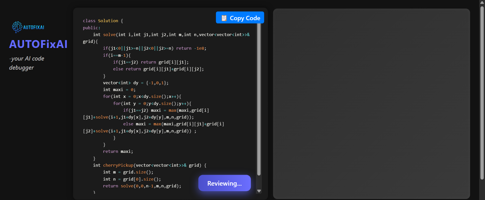

# AutoFixAI 🛠️🤖  
Your AI-Powered Code Reviewer built with React & Node.js

---

## 🚀 Overview

**AutoFixAI** is a web-based tool that provides **AI-generated code reviews** in real-time. Built using **React** for the frontend and **Node.js/Express** on the backend, it allows developers to paste code into an editor, submit it, and receive instant feedback, suggestions, and improvements using AI.

---

## ✨ Features

### ✅ AI Code Review
- Get real-time suggestions on your code using a backend-connected AI model.
- Supports **JavaScript** syntax highlighting and formatting.

### 📝 Live Code Editor
- Powered by [`react-simple-code-editor`](https://github.com/satya164/react-simple-code-editor).
- Syntax highlighting using **Prism.js**.
- Clean and responsive interface.

### 📃 Intelligent Review Panel
- Shows detailed suggestions, improvements, or issues found in your code.
- Auto-scrolls and styled for readability.

### 💡 Dynamic UI
- Responsive layout split into two clean sections: Editor & Review panel.
- Modern dark-themed design for better code focus.

### 🕵️‍♂️ Secure Environment Handling
- API keys and secrets are managed through `.env` files.
- Git is configured to **ignore `.env`** files to avoid exposing credentials.

### 📦 Modular Backend
- Built with **Express.js** to handle API requests.
- Easily extensible to support multiple languages and advanced review logic.

---

## 📁 Project Structure


```
AutoFixAI/
├── backend/
│   ├── server.js
│   └── routes/
│       └── ai.js
│   └── .env  // Not pushed to GitHub
├── frontend/
│   ├── src/
│   │   ├── App.jsx
│   │   ├── Editor.jsx
│   │   └── ...
│   └── public/
│       └── .env  // Not pushed to GitHub
├── .gitignore
└── README.md
```

---

## 🛠️ Tech Stack

| Frontend            | Backend             | AI Logic        |
|---------------------|---------------------|-----------------|
| React.js            | Node.js + Express   | OpenAI API / GPT |
| react-simple-code-editor | CORS, Axios, dotenv | Custom prompt templates |
| Prism.js (highlight) |                     |                 |

---

## 🧠 How It Works

1. User types or pastes code into the editor.
2. On clicking **"Review Code"**, the code is sent to the backend via POST request.
3. The backend sends the code to the AI model (e.g., OpenAI's GPT).
4. The response is parsed and displayed on the right-side review panel.

---
##Screenshots



## ⚙️ Setup Instructions

### 🔧 Backend Setup

```bash
cd backend
npm install
# Create a .env file with your API key
npm start
```
### 🔐 Environment Variables
In both the frontend and backend, create .env files.

Example for backend .env:

```bash
OPENAI_API_KEY=your_openai_key_here
```
### 🛑 .gitignore Configuration
To prevent .env and other sensitive files from being committed:

#### Example .gitignore (place in both /frontend and /backend):

```bash
.env
node_modules
dist
.DS_Store
```
## ✅ Future Improvements
- Support for multiple languages (Python, C++, etc.)

- Highlight suggestions in the editor

- Copy-to-clipboard and Save Review options

- Dark/Light mode toggle

- Auto-formatting & linting integration

- Mobile responsiveness
## 🙌 Contribution
Contributions are welcome! Feel free to fork the repo, raise issues, or submit PRs.

## 👨‍💻 Author
Made with ❤️ by Vipul Bhatt
If you find this useful, give it a ⭐ on GitHub!


